## Introducción / Sistema Real / Fundamentos

## Introducción y Modelo

:::: {.columns}
::: {.column width="50%"}
- Caracterización de transición orden-desorden en agentes autopropulsados.
- Tres escenarios: sin líder, líder fijo y líder circular.
- Contorno periódico en ambas direcciones.
- Lado de la caja $L = 1 \times 10^1$.
:::
::: {.column width="50%"}
- Densidad base $\rho = 4 \times 10^0$.
- Cantidad de partículas $N = 4 \times 10^2$.
- Radio de interacción $r_0 = 1 \times 10^0$.
- Velocidad constante $v_0 = 3 \times 10^{-2}$.
- Ruido angular uniforme de amplitud $\eta$.
:::
::::

## Implementación

## Implementación: arquitectura del motor

:::: {.columns}
::: {.column width="50%"}
- Motor de simulación modular para evolución temporal del sistema.
- Actualización sincrónica de las partículas en cada paso de tiempo.
- Cálculo de vecinos por radio de interacción y contorno periódico.
- Soporte de tres dinámicas: sin líder, líder fijo y líder circular.
:::
::: {.column width="50%"}
- Observable instantáneo:
	$$v_a(t)=\frac{1}{N v_0}\left|\sum_{i=1}^{N}\mathbf{v}_i(t)\right|$$
- Observable escalar estacionario:
	$$\langle v_a\rangle=\frac{1}{T_{est}}\sum_{t=t_s}^{t_{max}}v_a(t)$$
- El output primario es el estado del sistema vs tiempo.
- Los observables se calculan off-line a partir del estado.
:::
::::

## Implementación: pseudocódigo del loop temporal

```text
Inicializar partículas (x_i, y_i, theta_i)
Para t = 0 ... t_max:
	Para cada partícula i:
		Buscar vecinos en radio r0
		Aplicar mínima imagen periódica
		Calcular dirección promedio local
		Agregar ruido uniforme en [-eta/2, eta/2]
		Guardar nuevo ángulo de i
	Actualizar ángulos de todas las partículas
	Mover partículas con velocidad v0
	Aplicar contorno periódico
	Si hay líder externo (fijo o circular):
		Forzar su dinámica
	Exportar estado del sistema a archivo de texto
Fin
```

## Simulaciones

## Configuración del sistema simulado

:::: {.columns}
::: {.column width="50%"}
- Geometría: caja cuadrada con contorno periódico.
- Parámetros fijos base:
	- $L = 1 \times 10^1$
	- $\rho = 4 \times 10^0$
	- $r_0 = 1 \times 10^0$
	- $v_0 = 3 \times 10^{-2}$
- Inputs variables:
	- ruido angular $\eta$
	- escenario del líder
:::
::: {.column width="50%"}
- Outputs directos: estado del sistema vs tiempo.
- Observables derivados off-line:
	- $v_a(t)$
	- $\langle v_a\rangle$ estacionario
- Ventana estacionaria usada en base:
	- $t_s = 1.75 \times 10^2$
- Repeticiones por punto:
	- $5 \times 10^0$ corridas independientes
:::
::::

## Resultados

## Animación: Sin líder

:::: {.columns}
::: {.column width="40%"}
- Escenario: Sin partícula líder.
- Se evalúa la dinámica colectiva base.
- Vectores velocidad coloreados según ángulo.
:::
::: {.column width="60%"}
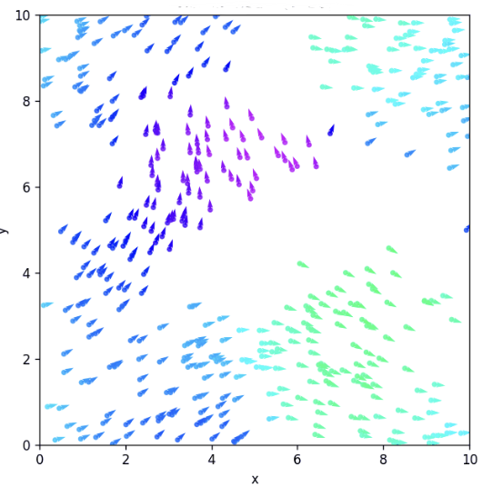

Link animación: [https://www.youtube.com/shorts/XXkGn0btGuo](https://www.youtube.com/shorts/XXkGn0btGuo)
:::
::::

## Animación: Líder con dirección fija

:::: {.columns}
::: {.column width="40%"}
- Escenario: Líder con dirección constante en el tiempo.
- Dirección inicial elegida aleatoriamente.
- Partícula líder identificada visualmente.
:::
::: {.column width="60%"}
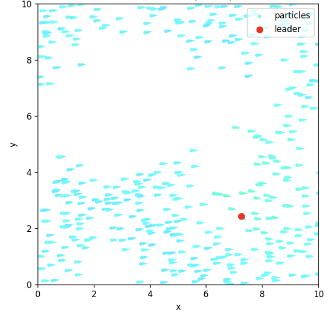

Link animación: [https://www.youtube.com/shorts/0Son8c38P_s](https://www.youtube.com/shorts/0Son8c38P_s)
:::
::::

## Animación: Líder circular

:::: {.columns}
::: {.column width="40%"}
- Escenario: Líder con trayectoria circular.
- Velocidad tangencial comparable a $v_0$.
:::
::: {.column width="60%"}
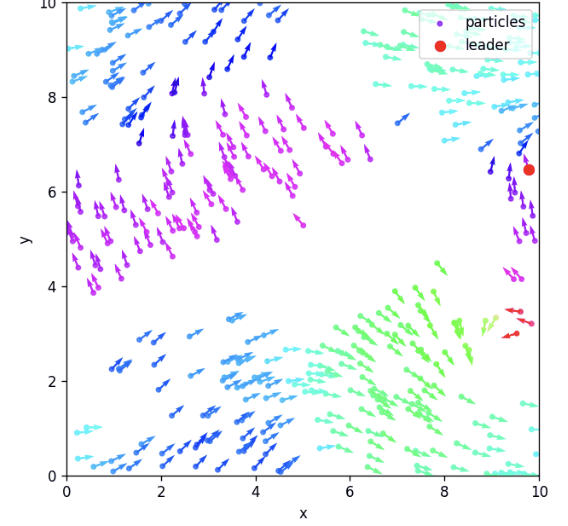

Link animación: [https://www.youtube.com/shorts/7ZK-rAYKzTA](https://www.youtube.com/shorts/7ZK-rAYKzTA)
:::
::::

## Evolución temporal: Sin líder

:::: {.columns}
::: {.column width="40%"}
- Observable: polarización instantánea $v_a(t)$.
- Escenario: Sin líder.
- Muestra transiente inicial y estabilización.
:::
::: {.column width="60%"}
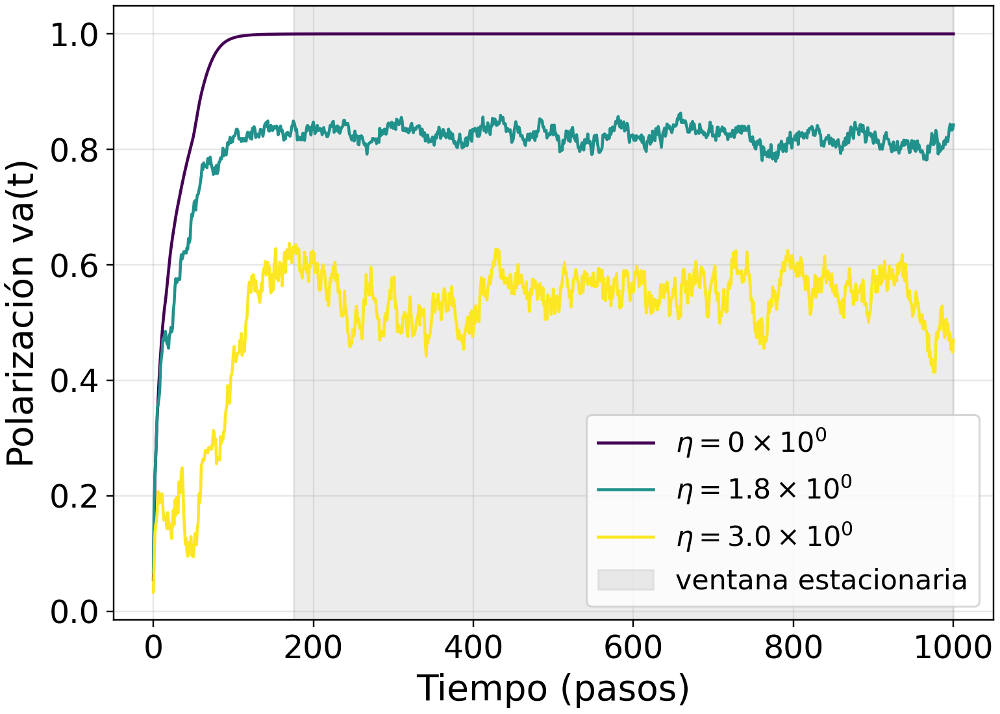
:::
::::

## Evolución temporal característica: Líder con dirección fija

:::: {.columns}
::: {.column width="40%"}
- Observable: $v_a(t)$.
- Escenario: Líder con dirección fija.
- El ruido angular $\eta$ afecta la polarización final.
- Se calcula escalar estacionario $\langle v_a \rangle$.
:::
::: {.column width="60%"}
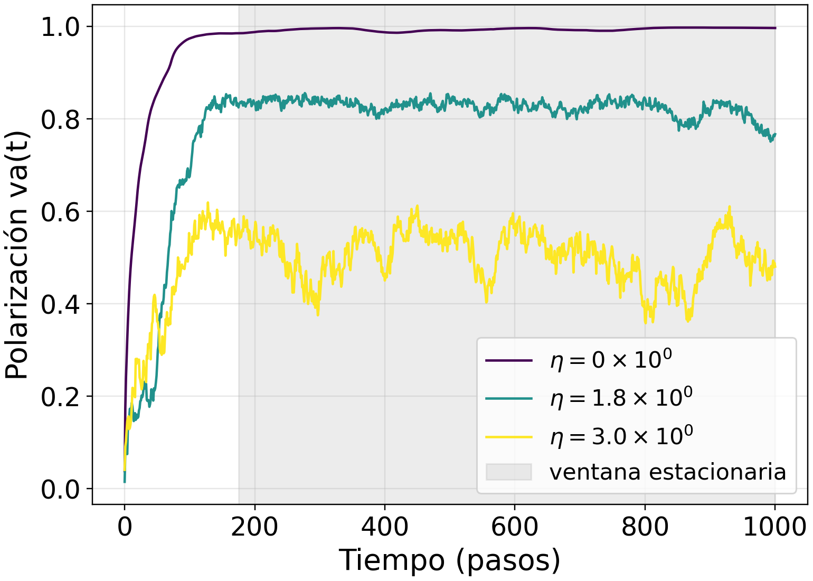
:::
::::

## Evolución temporal característica: Líder circular

:::: {.columns}
::: {.column width="40%"}
- Observable: $v_a(t)$.
- Escenario: Líder circular.
- Se determina ventana estacionaria a partir de estas curvas.
:::
::: {.column width="60%"}
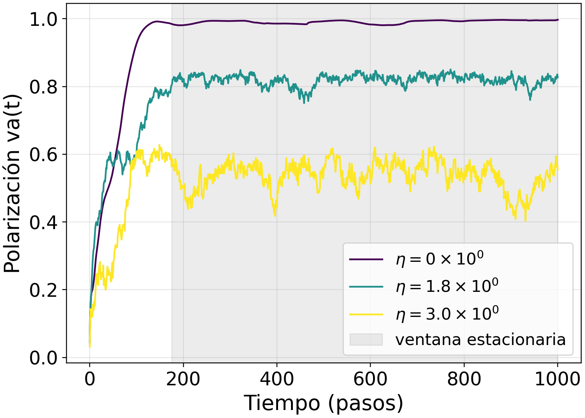
:::
::::

## Comparación temporal característica: $\eta = 0.00$

:::: {.columns}
::: {.column width="40%"}
- Ruido nulo: $\eta = 0 \times 10^0$.
- Polarización estacionaria $\langle v_a \rangle \approx 1 \times 10^0$ para los tres escenarios.
- Sistema altamente ordenado.
:::
::: {.column width="60%"}
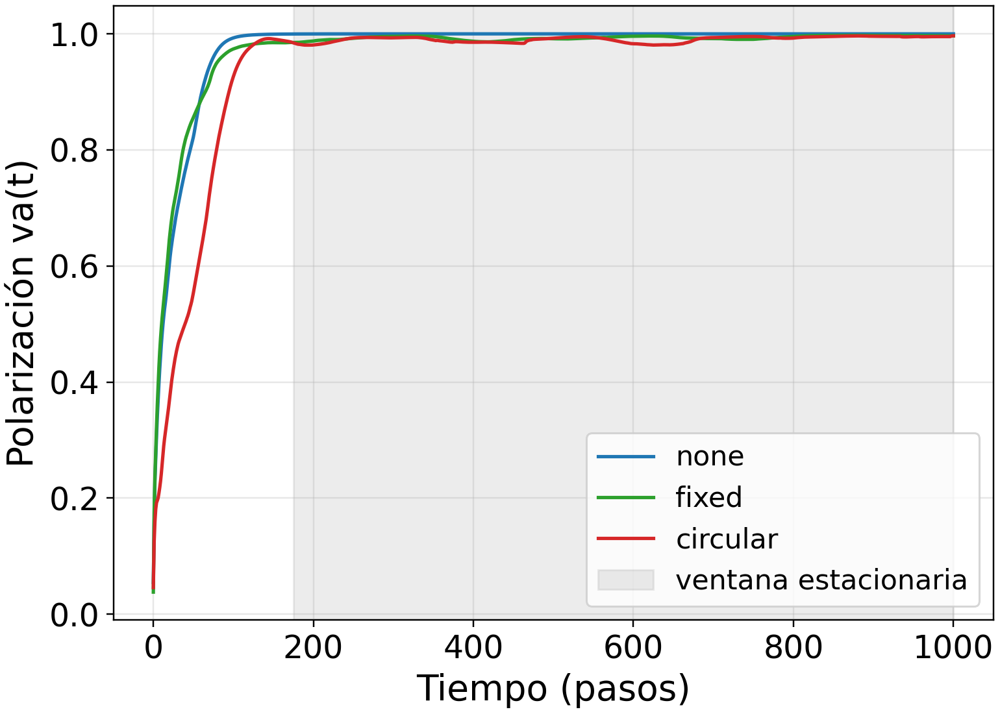
:::
::::

## Comparación temporal: $\eta = 1.80$

:::: {.columns}
::: {.column width="40%"}
- Observable: $v_a(t)$.
- Ruido intermedio: $\eta = 1.8 \times 10^0$.
- Descenso moderado de la polarización $\langle v_a \rangle \approx 8.2 \times 10^{-1}$.
- Comportamiento similar entre escenarios.
:::
::: {.column width="60%"}
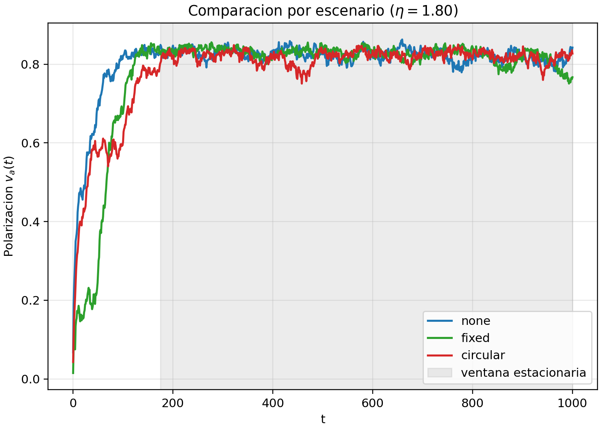
:::
::::

## Comparación temporal: $\eta = 3.00$

:::: {.columns}
::: {.column width="40%"}
- Observable: $v_a(t)$.
- Ruido alto: $\eta = 3 \times 10^0$.
- Caída significativa en el orden.
- Valores estacionarios cercanos a $5 \times 10^{-1}$.
:::
::: {.column width="60%"}
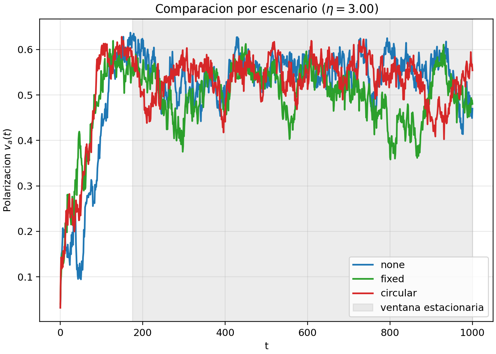
:::
::::

## Curva $\langle v_a\rangle$ vs $\eta$: Sin líder

:::: {.columns}
::: {.column width="40%"}
- Observable estacionario $\langle v_a \rangle$ vs ruido $\eta$.
- Escenario: Sin líder.
- Muestra barras de error asociadas a la media estacionaria.
:::
::: {.column width="60%"}
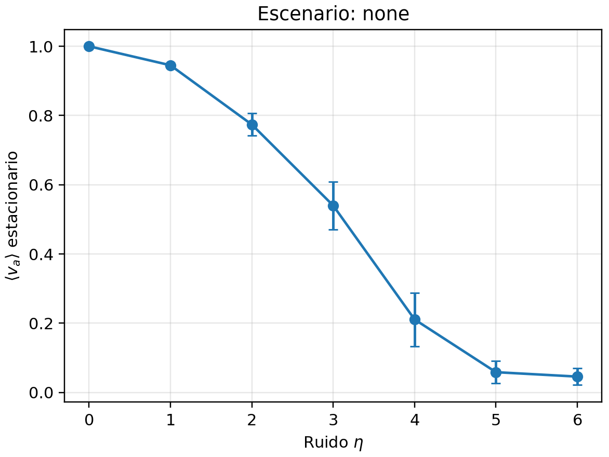
:::
::::

## Curva $\langle v_a\rangle$ vs $\eta$: Líder con dirección fija

:::: {.columns}
::: {.column width="40%"}
- Observable estacionario $\langle v_a \rangle$ vs ruido $\eta$.
- Escenario: Líder con dirección fija.
- Transición gradual hacia el desorden.
:::
::: {.column width="60%"}
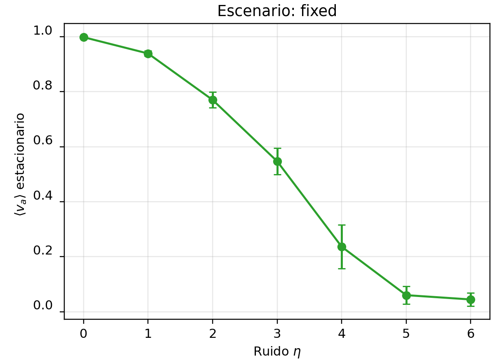
:::
::::

## Curva $\langle v_a\rangle$ vs $\eta$: Líder circular

:::: {.columns}
::: {.column width="40%"}
- Observable estacionario $\langle v_a \rangle$ vs ruido $\eta$.
- Escenario: Líder circular.
- Caída de $\langle v_a\rangle$ al aumentar $\eta$.
:::
::: {.column width="60%"}
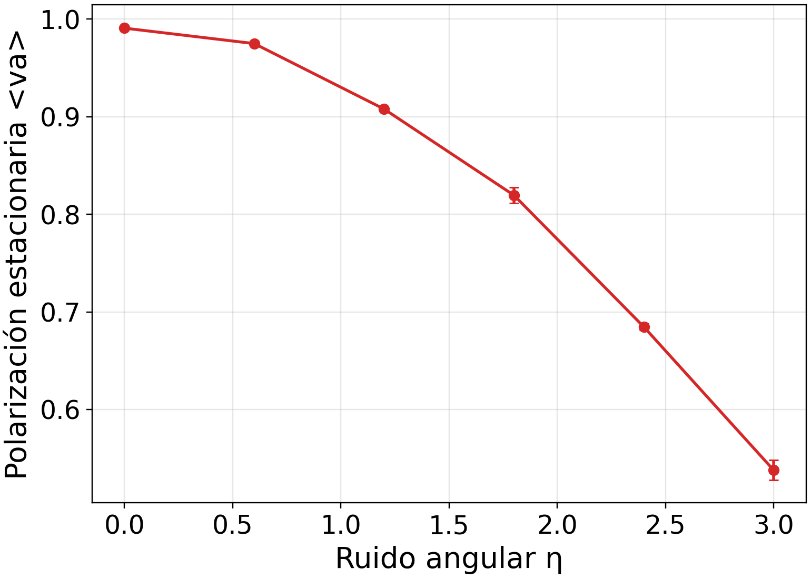
:::
::::

## Comparación de Escenarios

:::: {.columns}
::: {.column width="40%"}
- Comparativa de $\langle v_a \rangle$ para los tres casos.
- Decrecimiento progresivo del orden colectivo.
- Diferencias visibles pero moderadas entre escenarios en el rango estudiado.
:::
::: {.column width="60%"}
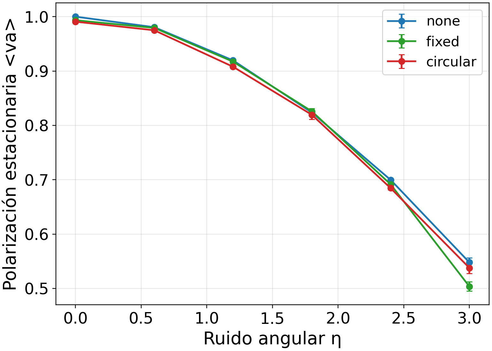
:::
::::

## Extensión opcional: Animaciones $\rho = 2$

:::: {.columns}
::: {.column width="40%"}
- Densidad baja: $\rho = 2 \times 10^0$.
- Animaciones para $\eta = 5 \times 10^{-1}$ y $\eta = 3 \times 10^0$.
- Se evalúa impacto del ruido con menor interacción local.
:::
::: {.column width="60%"}
Link animación (ruido bajo): [https://www.youtube.com/shorts/FrsD14uzri8](https://www.youtube.com/shorts/FrsD14uzri8)

Link animación (ruido alto): [https://www.youtube.com/shorts/y4YApFvEP-k](https://www.youtube.com/shorts/y4YApFvEP-k)
:::
::::

## Extensión opcional: Gráfico $\rho = 2$

:::: {.columns}
::: {.column width="40%"}
- Densidad $\rho = 2 \times 10^0$.
- Comparación de escenarios.
- Polarización estacionaria cae drásticamente a altos $\eta$ ($\approx 6 \times 10^{-2}$ para $\eta=6$).
:::
::: {.column width="60%"}
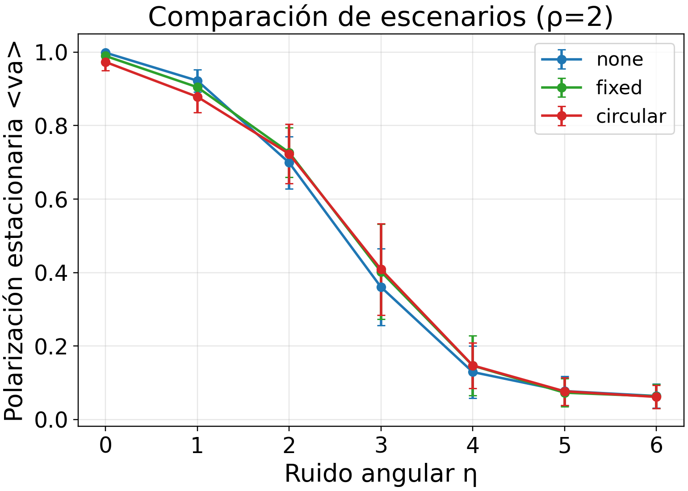
:::
::::

## Extensión opcional: Animaciones $\rho = 8$

:::: {.columns}
::: {.column width="40%"}
- Densidad alta: $\rho = 8 \times 10^0$.
- Animaciones para $\eta = 5 \times 10^{-1}$ y $\eta = 3 \times 10^0$.
- Mayor densidad implica mayor conectividad entre agentes.
:::
::: {.column width="60%"}
Link animación (ruido bajo): [https://www.youtube.com/shorts/lCtVQ0euHV8](https://www.youtube.com/shorts/lCtVQ0euHV8)

Link animación (ruido alto): [https://www.youtube.com/shorts/z5BwhoWZBR4](https://www.youtube.com/shorts/z5BwhoWZBR4)
:::
::::

## Extensión opcional: Gráfico $\rho = 8$

:::: {.columns}
::: {.column width="40%"}
- Densidad $\rho = 8 \times 10^0$.
- Comparación de escenarios.
- Al aumentar la densidad, la caída de $\langle v_a\rangle$ se vuelve más abrupta.
:::
::: {.column width="60%"}
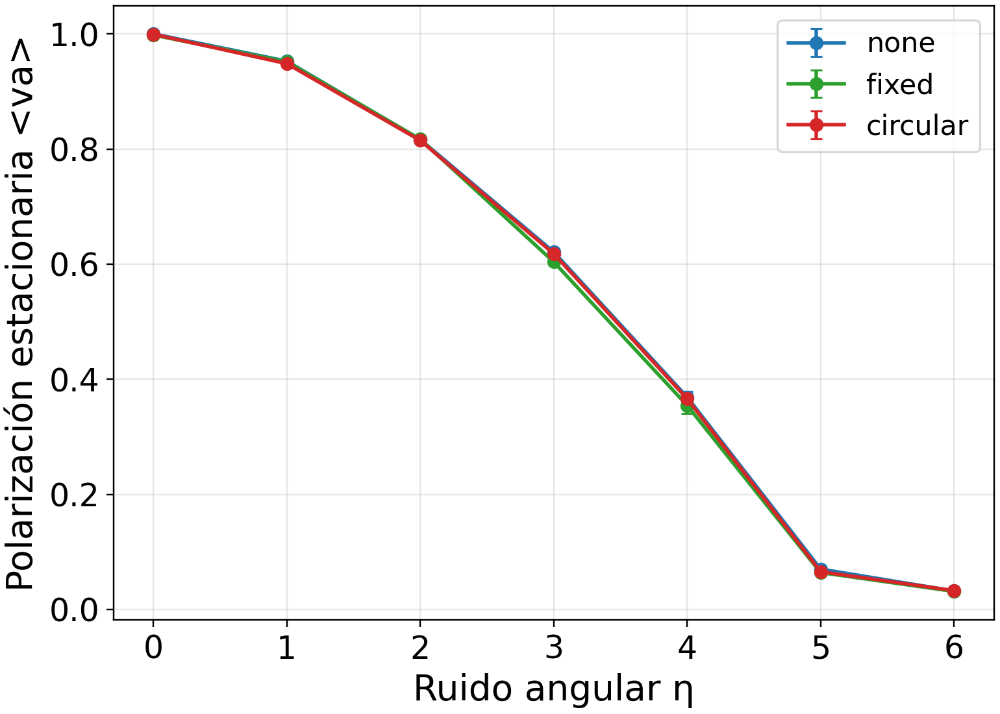
:::
::::

## Análisis del Líder: Ángulos (Líder Fijo)

:::: {.columns}
::: {.column width="40%"}
- Evolución angular $\theta_L(t)$ vs $\theta_S(t)$.
- Escenario: Líder con dirección fija.
- Ángulo del líder se mantiene constante.
- Ángulo promedio del sistema trata de alinearse.
:::
::: {.column width="60%"}
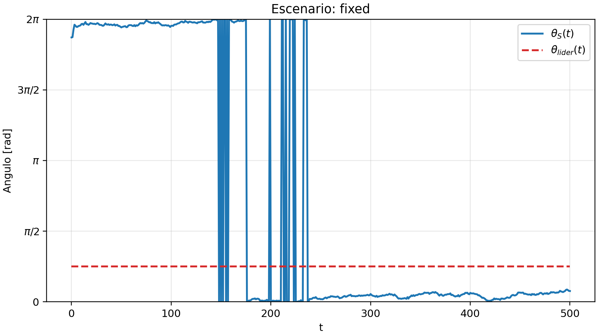
:::
::::

## Análisis del Líder: Ángulos (Líder Circular)

:::: {.columns}
::: {.column width="40%"}
- Evolución angular $\theta_L(t)$ vs $\theta_S(t)$.
- Escenario: Líder circular.
- Ángulo del líder varía linealmente en el tiempo.
- El grupo sigue la oscilación del líder.
:::
::: {.column width="60%"}
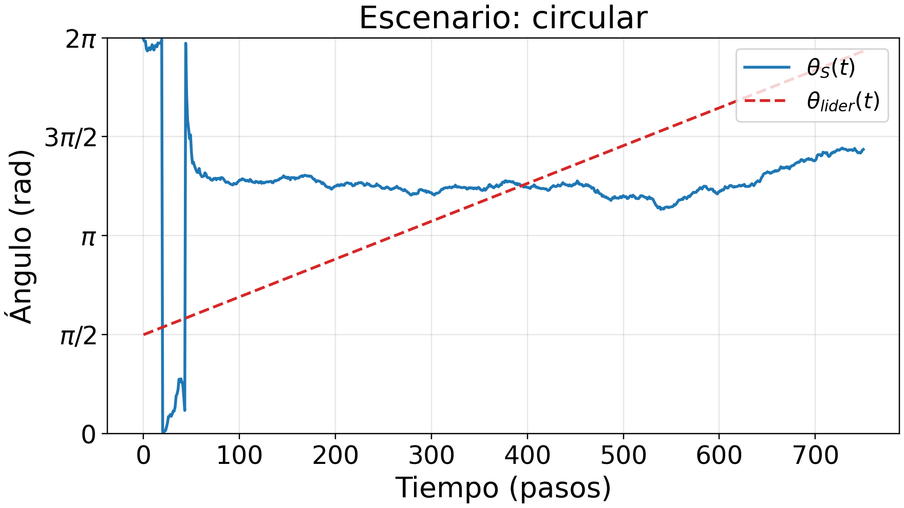
:::
::::

## Análisis del Líder: Correlación (Líder Fijo)

:::: {.columns}
::: {.column width="40%"}
- Correlación angular $C(t) = \cos(\theta_L - \theta_S)$.
- Escenario: Líder con dirección fija.
- Evalúa el acoplamiento direccional.
:::
::: {.column width="60%"}
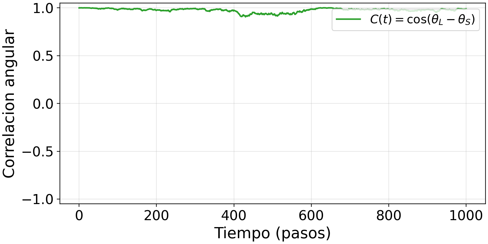
:::
::::

## Análisis del Líder: Correlación (Líder Circular)

:::: {.columns}
::: {.column width="40%"}
- Correlación angular $C(t) = \cos(\theta_L - \theta_S)$.
- Escenario: Líder circular.
- Permite ver desfasaje entre el sistema y la rotación impuesta.
:::
::: {.column width="60%"}
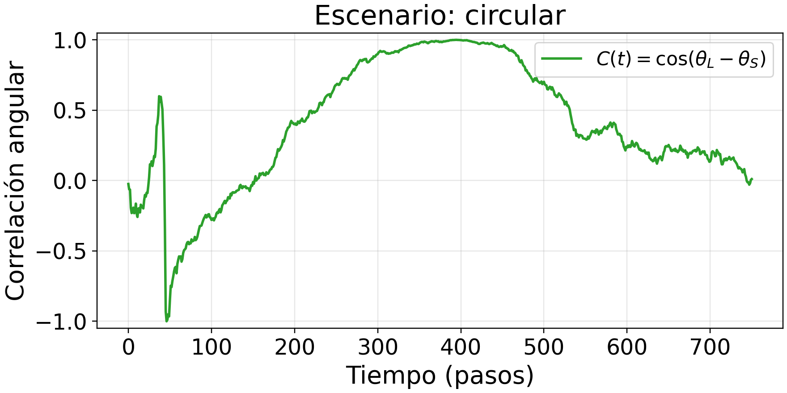
:::
::::

## Conclusiones

## Conclusiones

- En los tres escenarios, $\langle v_a\rangle$ decrece al aumentar $\eta$, evidenciando pérdida progresiva de orden colectivo.
- Para la densidad base de $\rho = 4 \times 10^0$, las diferencias entre escenarios (sin líder, líder fijo, líder circular) son visibles pero moderadas en el rango muestreado.
- En la extensión opcional, se observó que al aumentar la densidad poblacional, la caída de la polarización estacionaria $\langle v_a\rangle$ se vuelve más abrupta.
- Las observaciones aplican estrictamente para la resolución de valores de $\eta$ y repeticiones estudiadas.

##

\vfill
\begin{center}
\Huge Muchas gracias
\end{center}
\vfill